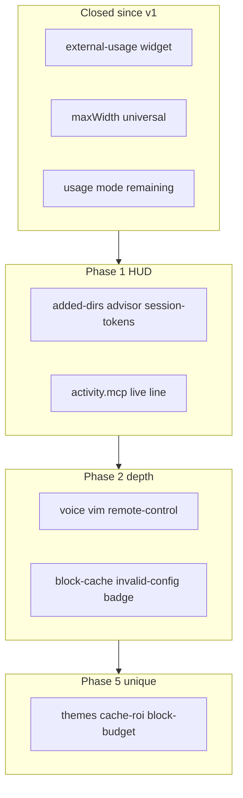
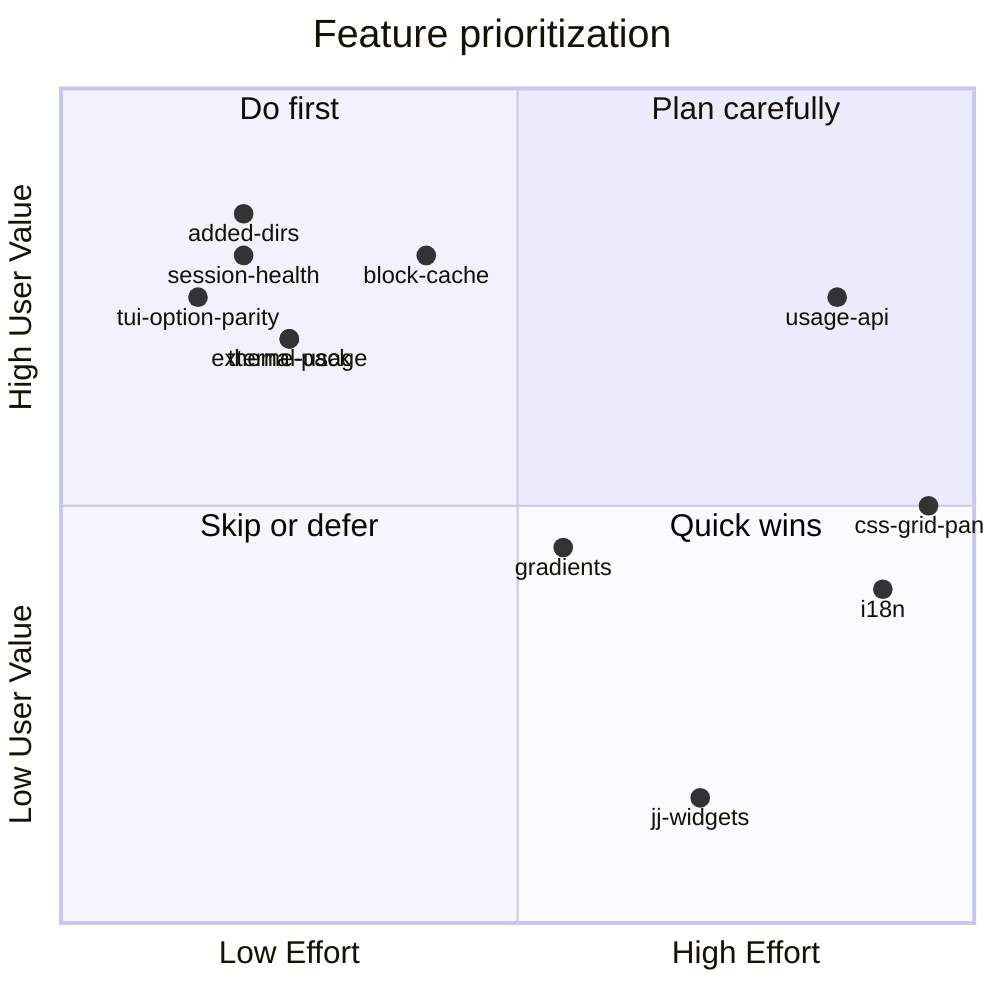

# cc-status-dash Feature Verification & Enhancement Plan (v2 — re-scan)

**Re-verified:** 2026-06-30 via 4 parallel rescans of `cc-status-dash`, `claude-hud`, `ccstatusline`, and ANALYSIS §2.1–2.5 (other 5 tools).

---

## What changed since v1 plan

| Finding | Impact on plan |
|---------|----------------|
| **102 widgets** (+`external-usage`) | Closes ccstatusline ExtraUsage* and HUD external-usage read path |
| **`maxWidth`** in renderer + universal TUI options | Closes ccstatusline truncation gap |
| **`usage.*` `mode: remaining`** on all usage widgets | Closes partial HUD `usageValue: remaining` |
| **`hoursOnly`** on reset timers (code + COMPARISON) | Partial timer parity — still need locale/weekday in TUI |
| **Docs drift** | PARITY/STATUS still say 101; COMPARISON contradicts itself on ExtraUsage |
| **~15 widget options work in JSON but not TUI** | New Phase 0b — high ROI, no new features |

**Revised parity score:**

| Source | Implemented | Partial | Missing | Notes |
|--------|-------------|---------|---------|-------|
| Claude HUD | ~20 / 25 | ~3 | ~2 | i18n + compact layout engine deferred |
| ccstatusline | ~74 / 85 | ~5 | ~6 | jj/vim/voice/API families |
| ANALYSIS 7-tool union | **~94%** | ~4% | ~2% | Niche from other 5 tools |

---

## Current inventory (verified)

| Area | Count | Key files |
|------|-------|-----------|
| Widgets | **102** | [src/widgets/index.ts](src/widgets/index.ts) |
| Themes | **5** | [src/themes/index.ts](src/themes/index.ts) |
| Presets | **30** | [src/config/defaults.ts](src/config/defaults.ts) |
| Line styles | **3** | inline / powerline / capsule |
| TUI screens | **4** | layout / options / global / colors |
| Data providers | **6** | stdin, git, transcript, system, stats, rate_limits |
| Option reference | [docs/OPTIONS.md](docs/OPTIONS.md) | 22 widget-specific + 7 universal |

---

## Gap analysis — revised by relevance

### Tier 1 — High relevance (user-visible, implementable soon)

#### Claude HUD (not yet in plan detail)

| Gap | Why it matters | Suggested approach |
|-----|----------------|-------------------|
| **added-dirs** | `/add-dir` multi-root sessions are common | Widget + `workspace.added_dirs` in [src/types.ts](src/types.ts); OSC8 links |
| **advisor** | `/advisor` sessions need model visibility | Parse `advisorModel` in [src/data/transcript.ts](src/data/transcript.ts) |
| **session-tokens** | HUD shows cumulative in/out/cache | Widget using existing `sessionTokens` in transcript data |
| **activity.mcp** | Live server names vs `mcp-count` only | Port [claude-hud/skills-mcp-line.ts](D:\claude-hud\src\render\skills-mcp-line.ts) logic |
| **Provider-aware cull** | Bedrock/Vertex users see misleading usage/cost | Auto-return `[]` from usage/cost widgets when provider detected |
| **Limit reached @ 100%** | Clear UX when quota exhausted | `⚠ Limit reached` + reset time on usage widgets |
| **usageCompact** | Dense single-line usage `5h: 25% (1h 30m)` | Option on `usage.block` / preset |
| **context tokens/both** | `45k/200k` or `45% (45k/200k)` | `context-length` display mode or `context.bar` option |
| **git.files** | Per-file `+file.ts (+4 -1)` with OSC8 | New widget; git provider already has file stats potential |
| **showSeparators** | Visual break before activity lines | Global `activitySeparator: boolean` |
| **session-start-date** | Session age context | Widget from transcript `sessionStart` |
| **OSC-8-safe autoWrap** | Links break on wrap without close sequence | Port `closeOpenHyperlink` from claude-hud renderer |
| **modelOverride** | Manual label when model string ugly | Option on `model` widget |

#### ccstatusline (not yet in plan detail)

| Gap | Why it matters | Suggested approach |
|-----|----------------|-------------------|
| **Invalid-config hot-path badge** | Corrupt JSON shouldn't silently confuse users | Render defaults + `⚠ invalid config` prefix (ccstatusline pattern) |
| **Block-cache** | JSONL re-parse every 300ms is expensive | Disk cache `~/.cache/cc-status-dash/block-*.json` |
| **Separator collapse** | Empty widgets leave orphan `│` | Drop separators around culled widgets |
| **Skills hook cache** | More accurate than transcript tail grep | Optional hook file watcher or read ccstatusline cache format |
| **Thinking-effort fallback** | stdin may omit effort | Chain: stdin → transcript → settings; support `default`/`?` |
| **custom-command parity** | Power users pipe stdin JSON to commands | `preserveColors`, `timeout`, pass payload |
| **hideNoGit / hideNoRemote** | Cleaner lines outside repos | Per-git-widget option |
| **TUI option parity** | 15+ options JSON-only today | Phase 0b — see todo `tui-option-parity` |

#### From other 5 ANALYSIS tools (new in v2)

| Gap | Source | Why relevant |
|-----|--------|--------------|
| **Theme pack + light theme** | claudia, powerline, CCometixLine | 5 themes vs 11–20 upstream; light terminal users underserved |
| **cache-roi widget** | claudia, rz1989s | $/tokens saved from cache — complements `cache-hit-rate` |
| **budget scope: block** | claude-powerline | Dollar cap for current 5h window (not just % threshold) |
| **MAX_LAYERS > 5** | rz1989s (9), powerline (unlimited) | Power users want dashboard density; trivial schema change |
| **MCP health** | rz1989s | Beyond count — connection state if CC exposes it |

---

### Tier 2 — Medium relevance (power users, more effort)

| Gap | Source | Notes |
|-----|--------|-------|
| **mergeGroups** with width fallback + label align | HUD | Width-aware group merge; port `label-align.ts` |
| **flexMode + flex-separator** | ccstatusline | Smart truncation; pairs with separator widgets |
| **Powerline caps + auto-align + font install** | ccstatusline | Premium layout; TUI sub-screen |
| **Gradients** (14 presets) | ccstatusline | Color layer extension |
| **Adaptive bar width** (4/6/10 by terminal) | HUD | [src/render/bars.ts](src/render/bars.ts) |
| **timeFormat modes** on timers | HUD | absolute / elapsed / both |
| **autoCompactWindow** denominator | HUD | Fixed 200k context % matching `/context` |
| **Bounded stdin read** (256KB cap, timeouts) | HUD | Prevents statusline hangs |
| **CLAUDE_STATUS_DASH_DISABLE** kill switch | HUD | `CLAUDE_HUD_DISABLE` equivalent |
| **TUI install/update/uninstall** | ccstatusline | Pinned vs `@latest`; medium onboarding value |
| **Usage API + weekly sonnet/opus** | ccstatusline | Network + auth; async prefetch only |
| **JSONL streaming dedupe** | ccstatusline | Accurate tool/token counts |
| **dim: 'parens'**, **merge: 'no-padding'** | ccstatusline | Styling polish |
| **Bar invert / time cursor / slider modes** | ccstatusline | Beyond static `barStyle` |
| **Compaction glitch filter** | ccstatusline | Ignore transient <1% context frames |

---

### Tier 3 — Low relevance / defer

| Item | Reason to defer |
|------|-----------------|
| **Jujutsu (8 widgets)** | Requires `jj` CLI; tiny user base — opt-in only |
| **i18n (zh-Hans)** | High maintenance; defer until contributor |
| **CSS-grid TUI panel** | Large effort; flex mode may suffice |
| **SQLite / Turso** | JSON stats store works; out-of-scope |
| **--extra-cmd arbitrary shell** | Security risk on every refresh |
| **AIWatch integration** | Document as custom-command recipe only |
| **npm provenance / pinned global** | Release infra, not product feature |
| **Islamic prayer times** | Explicitly out-of-scope |
| **CCometixLine patcher** | Out-of-scope |
| **Web configurator** | Out-of-scope |
| **Compact layout engine** (`lineLayout`) | Achievable via `hud-compact` preset without global mode |
| **Remote control widget** | Niche; include in Phase 2 bundle (low cost) |

---

## Already shipped — remove from gap list

- `external-usage` widget (read JSON file; `path`/`mode`/`barStyle`/`maxAgeMs`; env `CC_STATUS_DASH_EXTERNAL_USAGE`)
- `maxWidth` truncation + TUI editing (all 102 widgets)
- Universal per-widget styling in TUI (`color`, `bgColor`, `bold`, `dim`, `rawValue`, `merge`, `maxWidth`)
- `usage.block` / `usage.weekly` / `session-usage` / `weekly-usage` **`mode: remaining`**
- `reset-timer` / `weekly-reset-timer` **`hoursOnly`** (in code; document in OPTIONS.md)
- CJK/emoji `displayWidth` for auto-wrap
- Pace delta, burn-rate modes, budget, cost-projection, daily/weekly/monthly cost
- Security: project-config trust scoping, OSC8 validation, sanitize

---

## Unique features to add (beyond all upstream)

Prioritized by differentiation value:

| Feature | Description | Effort |
|---------|-------------|--------|
| **`session-health`** | One widget: context % + pace ⇡/⇣ + minutes to reset | Low |
| **`cache-roi`** | Estimated $/tokens saved from prompt cache hits | Low |
| **`budget` scope: `block`** | Dollar cap for current 5h window | Low |
| **`preset: hud-compact`** | Single-line HUD mirror without layout engine | Low |
| **Theme pack** | +dracula, catppuccin, one-dark, rose-pine, **hud-light** | Low |
| **`MAX_LAYERS: 9`** | Match rz1989s density | Trivial |
| **Config profiles** | Named snapshots in TUI (`dev`/`monitor`) | Medium |
| **Usage sidecar writer** | Emit `rate_limits` JSON for external tools (pairs with `external-usage`) | Medium |
| **Hook compaction live state** | `Compacting…` via PreCompact hook file | Medium |
| **`--diff-config`** | Compare two configs / presets in CLI | Low |
| **Widget category filter in TUI picker** | 102 widgets need search/filter | Low |
| **`activity.separator` widget** | Composable `────` instead of global only | Low |

**cc-status-dash exclusives to keep marketing:** `activity.tool-counts`, `context-1m`, `context-percentage-usable`, `capsule` style, 30 presets, persistent stats store, pace + budget + projection stack.

---

## Implementation phases (revised)

### Phase 0 — Hygiene (1–2 days)

- Sync [docs/STATUS.md](docs/STATUS.md), [docs/PARITY.md](docs/PARITY.md), [docs/COMPARISON.md](docs/COMPARISON.md) to **102 widgets**
- Mark `external-usage` ✅; remove stale ExtraUsage gap bullets
- Remove duplicate "Remaining" items already Done (auto-reset, tokens/min, COLORTERM, worktree-original-branch)
- Widget ID snapshot test (`listWidgets()` vs documented set)
- Cross-check [docs/OPTIONS.md](docs/OPTIONS.md) with `optionSpec.ts`

### Phase 0b — TUI option parity (2–3 days, parallel with Phase 0)

Expose JSON-only options in [src/tui/optionSpec.ts](src/tui/optionSpec.ts):

`burn-rate.mode`, `skills.mode`, `cache-timer.ttlSeconds`, `git-ahead-behind` thresholds, `session-clock`/`reset-timer` `hour12`/`timezone`, `activity.tool-counts.max`, `token-breakdown.threshold`, `provider.showApi`, `env.prefix`

### Phase 1 — HUD closure (~1 week)

1. Stdin/transcript: `added_dirs`, `advisorModel`, `sessionStart`
2. Widgets: `added-dirs`, `advisor`, `session-tokens`, `activity.mcp`, `session-start-date`
3. UX: effort symbols, provider cull, limit-reached, `usageCompact`, context `tokens`/`both` modes, `showSeparators`
4. Preset: `hud-compact`
5. `model.override` option

**Tests:** transcript fixtures, sample-input.json updates, widget render tests

### Phase 1b — HUD render engine (~3–4 days)

- `git.files` per-file OSC8 widget
- OSC-8-safe `autoWrap`
- Adaptive bar width
- Clickable `cwd` (OSC8 `file://`)
- `colors.usageWarning` semantic key

### Phase 2 — ccstatusline state + resilience (~1 week)

- Widgets: `voice-status`, `remote-control-status`, `vim-mode`
- `data/system.ts` config readers (port from ccstatusline)
- Thinking-effort fallback chain
- Invalid-config badge on hot path
- Block-cache for JSONL metrics
- Separator collapse
- `CC_STATUS_DASH_DISABLE=1`, bounded stdin read
- `CCSTATUSLINE_WIDTH` env alias

### Phase 2b — Option depth (~3 days)

- `dim: 'parens'`, `merge: 'no-padding'`
- `windowSeconds` on speed widgets
- Compaction format/triggers/reclaimed (if transcript data available)
- `linkToIDE` / `linkToRepo` on git widgets
- `hideNoGit`, `hideNoRemote`, symbol overrides
- Timer `locale` / `weekday`

### Phase 3 — Layout & powerline (~2 weeks)

- flexMode, flex-separator, separator layout widgets
- Powerline caps, auto-align, custom hex separators
- Gradients (14 presets)
- Global overrides: inheritSeparatorColors, override FG/BG
- TUI: wrap-around nav, refreshInterval → `settings.json`, install/update screen, gradient picker

### Phase 4 — Usage API (~2 weeks)

- Async usage API provider (never blocks render)
- `weekly-sonnet-usage`, `weekly-opus-usage`, `extra-usage-used` (API-sourced — distinct from file-based `external-usage`)
- JSONL streaming dedupe
- Optional external-usage **write** sidecar from stats store

### Phase 5 — Unique differentiators (~1 week, can start after Phase 1)

- `session-health`, `cache-roi`, `budget scope: block`
- Theme pack (+5 palettes incl. `hud-light`)
- `MAX_LAYERS: 9`
- Config profiles in TUI
- Skills hook cache reader
- Widget category filter in picker

### Deferred

- Jujutsu provider (8 widgets) — on demand
- i18n — contributor-driven
- CSS-grid panel — after flex evaluation
- SQLite stats — opt-in variant later

---

## Relevance matrix (what to skip vs prioritize)

**Do first (Q2+Q4):** Phase 0/0b, Phase 1, session-health, theme pack, block-cache  
**Plan carefully (Q1):** Usage API, powerline depth, mergeGroups  
**Skip/defer (Q3):** Jujutsu, prayer times, extra-cmd, patcher

---

## Verification checklist

- [ ] `bun run src/index.ts --list-widgets` → 102 ids match OPTIONS.md + snapshot test
- [ ] Every Claude HUD `HudElement` maps to widget or preset (table in PARITY.md)
- [ ] Every ccstatusline widget: ✅ / deferred-with-reason / out-of-scope
- [ ] `external-usage` marked ✅ in PARITY; ExtraUsage API widgets still 🗺️
- [ ] All `WIDGET_OPTION_SPECS` keys render correctly (matrix test)
- [ ] TUI `widgetFields()` covers every JSON-documented option
- [ ] sample-input.json includes `added_dirs`, `vim`, `advisorModel` after Phase 1

---

## Risk notes (updated)

- **external-usage** already trust-scoped — extend same pattern to write sidecar
- **Usage API** must use background prefetch + disk cache; never `await` on render path
- **Invalid-config badge** must not write corrupt file back
- **Block-cache** TTL must respect session boundaries
- **git.files** widget: cap file count + respect terminal width (HUD hides below 60 cols)
- **Theme pack**: test all 102 widgets × new themes in matrix.test.ts

---

## Suggested execution order

1. **Phase 0 + 0b** (docs + TUI option parity) — immediate trust win, no new widgets
2. **Phase 1 + 1b** (HUD closure) — closes largest visible gap vs claude-hud
3. **Phase 5 subset** (session-health, themes, cache-roi, block-budget) — parallel differentiation
4. **Phase 2 + 2b** (resilience + cc-state widgets) — production hardening
5. **Phase 3** (layout depth) — power users
6. **Phase 4** (usage API) — subscriber-only metrics

Phases 0–1 deliver the "complete vs HUD + ccstatusline" story. Phase 5 makes cc-status-dash **better than both**, not just equal.
