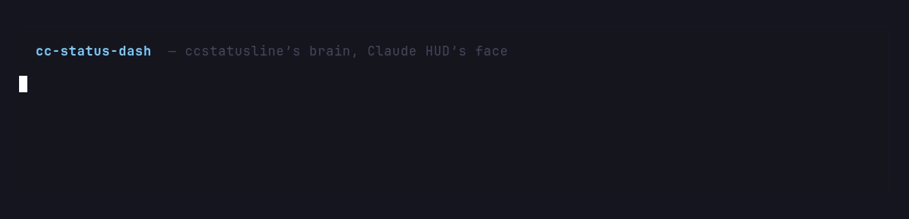

<div align="center">

# cc-status-dash

**A feature-rich statusline _and_ HUD dashboard for Claude Code.**

_ccstatusline's brain, Claude HUD's face._

[](https://www.npmjs.com/package/cc-status-dash)
[](https://www.npmjs.com/package/cc-status-dash)
[](https://github.com/techiewonk/cc-status-dash/actions/workflows/ci.yml)
[](LICENSE)
[](https://nodejs.org)



</div>

It fuses the two most popular Claude Code statusline tools into one:

- **Config pattern from [ccstatusline](https://github.com/sirmalloc/ccstatusline)** — a widget pipeline: ordered `widgets[]` per line, each with its own options; multiple lines; one JSON config; an Ink TUI editor (`--tui`) with a fuzzy widget picker.
- **Theme / clean look from [Claude HUD](https://github.com/jarrodwatts/claude-hud)** — a restrained palette, preset-first onboarding, context-health framing, and live tool / agent / todo activity lines.

Plus the best ideas from the wider ecosystem: **pace delta** (burn vs. time-left) from claude-pace, multiple bar styles from claude-powerline, and up to a 5-layer dashboard.

> **111 widgets · 10 themes · 35 presets (1–9 layers) · 3 render styles · 10 bar styles**

---

## Table of contents

- [Quick start](#quick-start)
- [What you see](#what-you-see)
- [Presets](#presets)
- [Configuration](#configuration)
- [Themes & colors](#themes--colors)
- [Widgets](#widgets)
- [CLI](#cli)
- [How it works](#how-it-works)
- [Development & testing](#development--testing)
- [Docs](#docs)
- [Credits](#credits)

---

## Quick start

### As a Claude Code plugin (recommended)

```
/plugin marketplace add techiewonk/cc-status-dash
/plugin install cc-status-dash
/cc-status-dash:setup
```

### Via npm / npx

Add to `~/.claude/settings.json`:

```json
{
  "statusLine": {
    "type": "command",
    "command": "npx -y cc-status-dash@latest",
    "padding": 0,
    "refreshInterval": 10
  }
}
```

Prefer **Bun** for ~4× faster per-render startup — swap the command for `bunx cc-status-dash@latest`.
The shipped bundle is `--target=node`, so it runs on both runtimes. Restart Claude Code once;
after that, edits to `~/.claude/cc-status-dash.json` reload with no restart.

> No Nerd Font? Set `"charset": "text"` for ASCII-only output.

---

## What you see

The default `essential` preset — identity on top, health below:

```
 ✱ Opus 4.8  cc-status-dash  main
 Context █████░░░░░ 54% left  │  5h 38% ⇣274%
```

Add an **activity** line (`showWhen: "activity"`) and it appears only while tools/agents/todos run, then collapses:

```
 ▶ Bash ×12 · Edit ×5   ⚙ explore   ☑ 2/5  Fix bug
```

Want it all on **one line**? The `oneline` family packs everything into a single row:

```
 ✱ Opus 4.8  │  cc-status-dash  │  main  │  Context 54% left  │  5h 38% ⇣274%  │  $3.42
```

---

## Presets

35 presets grouped by layer count — pick density first, then flavor (`--list-presets` shows all):

| Layers | Presets |
|---|---|
| **1** | `minimal` · `vibe` · `pace` · `powerline` · **`oneline`** · `oneline-git` · `oneline-usage` · `oneline-activity` · `oneline-tokens` |
| **2** | `essential` _(default)_ · `compact` · `usage` · `git` · `hud` · `tokens` · `capsule` |
| **3** | `full` · `dev` · `monitor` · `cost` · `pace-focus` · `tokens-plus` |
| **4** | `dashboard` · `dashboard-git` · `dashboard-usage` · `dashboard-monitor` |
| **5** | `max` · `max-usage` · `max-monitor` · `max-cost` |

```bash
npx cc-status-dash --preset oneline   < sample-input.json   # everything on one line
npx cc-status-dash --preset dashboard < sample-input.json   # 4 layers
```

---

## Configuration

Config is one JSON file, re-read on **every render** (no restart). Resolution order — highest wins:

```
CLI flags > env > ./.cc-status-dash.json > ~/.claude/cc-status-dash.json > $CLAUDE_CONFIG_DIR > XDG > defaults
```

```json
{
  "preset": "custom",
  "theme": "tokyo-night",
  "charset": "unicode",
  "colors": { "model": "#7dcfff", "context": "#9ece6a" },
  "lines": [
    { "style": "powerline", "widgets": [
      { "id": "model", "show1M": true },
      { "id": "cwd", "segments": 2 },
      { "id": "git.branch", "showDirty": true, "showAheadBehind": true, "showDiff": true }
    ]},
    { "style": "inline", "widgets": [
      { "id": "context.bar", "mode": "remaining", "barStyle": "blocks" },
      { "id": "usage.block", "showPace": true },
      { "id": "cost" }
    ]},
    { "style": "inline", "showWhen": "activity", "widgets": [
      { "id": "activity.tools" }, { "id": "activity.agents" }, { "id": "activity.todos" }
    ]}
  ]
}
```

Every top-level option, per-widget option, bar style, color key, env var, and flag is documented in
**[docs/OPTIONS.md](docs/OPTIONS.md)**. Highlights:

| Option | Default | Does |
|---|---|---|
| `preset` / `lines` | `essential` | preset shortcut, or hand-built layout (≤5 lines) |
| `theme` | `hud-clean` | base palette (`--list-themes`) |
| `charset` | `unicode` | `text` = ASCII fallback |
| `minimalist` | `false` | drop labels, raw values only |
| `globalBold` / `padding` / `separator` | `false` / `1` / `│` | global cosmetics |
| `autoWrap` | `false` | wrap inline lines to terminal width |
| `colors` | theme | per-key color overrides (named / 256 / hex) |

Each line picks a **render style** — `inline` (`a │ b │ c`), `powerline` ( arrows), or `capsule`
(` pills `) — and `showWhen: "activity"` to auto-collapse when idle.

---

## Themes & colors

Built-in themes (10): **`hud-clean`** (default), `tokyo-night`, `gruvbox`, `nord`, `catppuccin`, `dracula`, `one-dark`, `rose-pine`, **`hud-light`** (for light terminals), `mono`.

Pick one with `"theme"` / `--theme`, then override any individual color under `"colors"`. Values can be a
named color (`cyan`, `dim`), a 256-index (`208`), or hex (`#ff6600`). The theme is the base; your colors
layer on top. `NO_COLOR` is honored.

---

## Widgets

**111 widgets** across 8 categories — incl. cc-status-dash exclusives `session-health` (context + pace + reset at a glance) and `cache-roi` (`--list-widgets` for the full list):

| Category | # | Examples |
|---|---|---|
| git | 35 | `git.branch`, `git-status`, `git-changes`, `git-ahead-behind`, `git-worktree`, `git-pr` |
| usage | 16 | `usage.block` (5h), `usage.weekly` (7d), `cost`, `burn-rate`, `budget`, `external-usage`, `daily/weekly/monthly-cost` |
| activity | 14 | `activity.tools`, `activity.agents`, `activity.todos`, `activity.mcp`, `skills`, `mcp-count`, `message-count` |
| tokens | 14 | `tokens-total`, `tokens-cached`, `cache-hit-rate`, `cache-roi`, `session-tokens`, `tokens-per-min`, `total-speed` |
| system | 12 | `cwd`, `added-dirs`, `version`, `session-name`, `free-memory`, `terminal-width`, `config-counts` |
| context | 8 | `context.bar`, `context-percentage`, `session-health`, `context-length`, `compaction-counter` |
| model | 4 | `model`, `thinking-effort`, `provider`, `claude-account-email` |
| custom | 4 | `custom-text`, `custom-symbol`, `custom-command`, `link` |

---

## CLI

```bash
npx cc-status-dash --list-widgets     # 111 widgets
npx cc-status-dash --list-themes      # 10 themes
npx cc-status-dash --list-presets     # 35 presets
npx cc-status-dash --validate         # check config files in the resolution chain
npx cc-status-dash --configure        # @clack preset wizard (TTY)
npx cc-status-dash --tui              # Ink config editor with fuzzy picker (TTY)
echo '{ ... }' | npx cc-status-dash   # render a custom payload
```

---

## How it works

Claude Code pipes a JSON status payload on **stdin**; cc-status-dash prints the rendered line(s) to **stdout**.

```
stdin JSON + transcript JSONL
        │
   providers (git · transcript · system · stats) — only what the visible widgets need
        │
   widget registry  (collect → render → Segment[];  empty widgets auto-culled)
        │
   layout engine (lines → inline | powerline | capsule;  auto-wrap)
        │
   color layer (theme palette + custom colors + NO_COLOR/charset)
        │
      stdout
```

The render hot path never loads React/Ink (the TUI lives in lazy chunks), providers run lazily, and the
render path **never throws** — worst case it prints `Claude`.

---

## Development & testing

```bash
bun install
bun run build            # code-split bundle -> dist/
bun run demo             # render sample-input.json
bun test src             # 283 tests
bun run smoke            # full functionality check: every preset/theme/style/flag (45 checks)
```

The **[full development & manual-testing guide](docs/DEVELOPMENT.md)** covers the build, the automated
suites, the one-command smoke check, a manual testing matrix for every subsystem (presets, themes, charset,
stats, git/transcript widgets, the TUI/wizard), testing live inside Claude Code, Linux/CI parity via Docker,
extending widgets/presets/themes, and regenerating the demo GIF.

No Bun? `npm install && npm run build:node && node dist/index.js < sample-input.json`.

---

## Docs

- **[docs/OPTIONS.md](docs/OPTIONS.md)** — every option, widget option, bar style, color key, env var, flag.
- **[docs/DEVELOPMENT.md](docs/DEVELOPMENT.md)** — local dev + complete manual testing flow.
- **[docs/COMPARISON.md](docs/COMPARISON.md)** — option-level comparison vs. ccstatusline & claude-hud.
- **[docs/PARITY.md](docs/PARITY.md)** — feature-by-feature parity vs. 7 surveyed statuslines.
- **[docs/STATUS.md](docs/STATUS.md)** — what's done / in progress / out of scope.
- **[docs/ANALYSIS.md](docs/ANALYSIS.md)** — original design & deep dive.
- **[CLAUDE.md](CLAUDE.md)** — repo map & conventions for contributors.

---

## Credits

Standing on the shoulders of [ccstatusline](https://github.com/sirmalloc/ccstatusline),
[Claude HUD](https://github.com/jarrodwatts/claude-hud), claude-powerline, and claude-pace.

## License

[MIT](LICENSE)
